<html>
<head>

<title>Page Title</title>

</head>

<body>

<h1>MATURITY SCALE INDEX</h1>

<h4>*Last update : 24/06/2022*</h4>

:::::::::::::: {.columns}
::: {.column width="10%"}

\

:::
::: {.column width="80%"}

<h2>*Acanthostracion polygonius* / Honeycomb cowfish</h2>

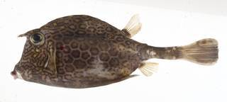{width=250px} {height=26px width=20px} [Female](Scale_Acanthostracion polygonius_F.html) / [Male](Scale_Acanthostracion polygonius_M.html) {height=26px width=20px}

\

<h2>*Acanthurus bahianus* / Barber surgeonfish</h2>

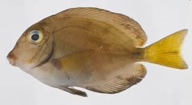{width=250px} {height=26px width=20px} [Female](Scale_Acanthurus bahianus_F.html) / [Male](Scale_Acanthurus bahianus_M.html) {height=26px width=20px}

\

<h2>*Aluterus scriptus* / Scribbled leatherjacket filefish</h2>

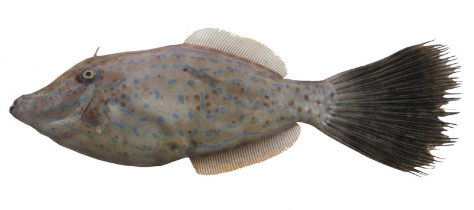{width=250px} {height=26px width=20px} [Female](Scale_Aluterus scriptus_F.html) / [Male](Scale_Aluterus scriptus_M.html) {height=26px width=20px}

\

<h2>*Argyrosomus regius* / Meagre</h2>

{width=250px} {height=26px width=20px} [Female](Scale_Argyrosomus regius_F.html) / [Male](Scale_Argyrosomus regius_M.html) {height=26px width=20px}

\

<h2>*Balistes vetula* / Queen triggerfish</h2>

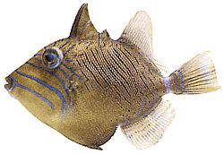{width=250px} {height=26px width=20px} [Female](Scale_Balistes vetula_F.html) / [Male](Scale_Balistes vetula_M.html) {height=26px width=20px}

\

<h2>*Calamus bajonado* / Jolthead porgy</h2>

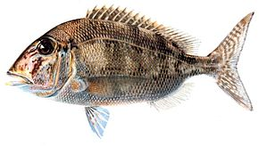{width=250px} {height=26px width=20px} [Female](Scale_Calamus bajonado_F.html) / [Male](Scale_Calamus bajonado_M.html) {height=26px width=20px}

\

<h2>*Cantherhines macrocerus* / American whitespotted filefish</h2>

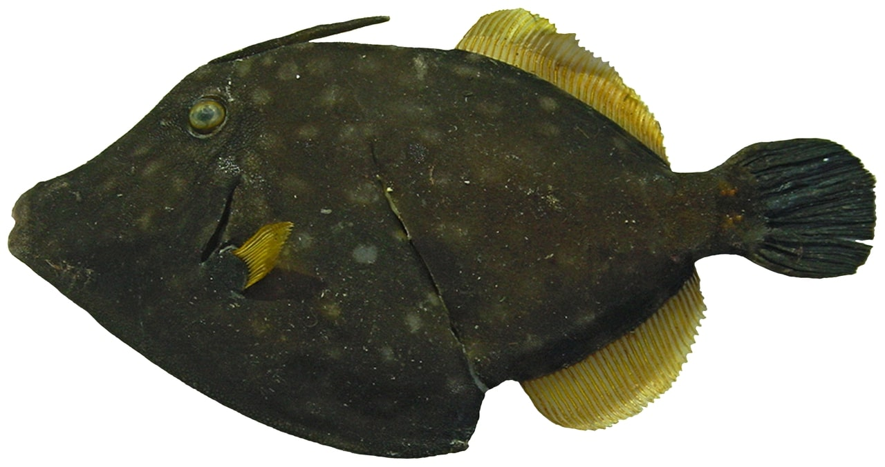{width=250px} {height=26px width=20px} [Female](Scale_Cantherhines macrocerus_F.html) / [Male](Scale_Cantherhines macrocerus_M.html) {height=26px width=20px}

\

<h2>*Canthidermis sufflamen* / Ocean triggerfish</h2>

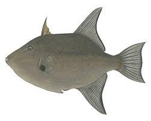{width=250px} {height=26px width=20px} [Female](Scale_Canthidermis sufflamen_F.html) / [Male](Scale_Canthidermis sufflamen_M.html) {height=26px width=20px}

\

<h2>*Caranx sp.* / Jack</h2>

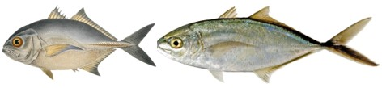{width=250px} {height=26px width=20px} [Female](Scale_Caranx sp._F.html) / [Male](Scale_Caranx sp._M.html) {height=26px width=20px}

\

<h2>*Chelidonichthys cuculus* / Red gurnard</h2>

{width=250px} {height=26px width=20px} [Female](Scale_Chelidonichthys cuculus_F.html) / [Male](Scale_Chelidonichthys cuculus_M.html) {height=26px width=20px}

\

<h2>*Clupea clupea* / Herring</h2>

{width=250px} {height=26px width=20px} [Female](Scale_Clupea clupea_F.html) / [Male](Scale_Clupea clupea_M.html) {height=26px width=20px}

\

<h2>*Engraulis encrasicolus* / Anchovy</h2>

{width=250px} {height=26px width=20px} [Female](Scale_Engraulis encrasicolus_F.html) / [Male](Scale_Engraulis encrasicolus_M.html) {height=26px width=20px}

\

<h2>*Epinephelinae sp.* / Grouper</h2>

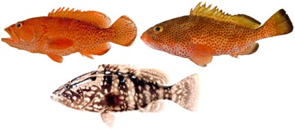{width=250px} {height=26px width=20px} [Female](Scale_Epinephelinae sp._F.html) / [Male](Scale_Epinephelinae sp._M.html) {height=26px width=20px}

\

<h2>*Etelis oculatus* / Queen snapper</h2>

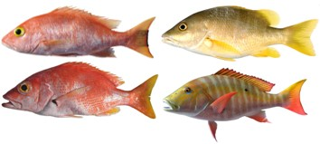{width=250px} {height=26px width=20px} [Female](Scale_Etelis oculatus_F.html) / [Male](Scale_Etelis oculatus_M.html) {height=26px width=20px}

\

<h2>*Dicentrarchus labrax* / Sea bass</h2>

{width=250px} {height=26px width=20px} [Female](Scale_Dicentrarchus labrax_F.html) / [Male](Scale_Dicentrarchus labrax_M.html) {height=26px width=20px}

\

<h2>*Flat fish sp.* / Flat fish</h2>

{width=250px} {height=26px width=20px} [Female](Scale_Flat fish sp._F.html) / [Male](Scale_Flat fish sp._M.html) {height=26px width=20px}

\

<h2>*Gadidae sp.* / Gadidae</h2>

{width=250px} {height=26px width=20px} [Female](Scale_Gadidae sp._F.html) / [Male](Scale_Gadidae sp._M.html) {height=26px width=20px}

\

<h2>*Haemulon sp.* / Grunt</h2>

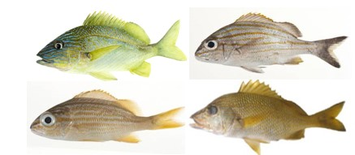{width=250px} {height=26px width=20px} [Female](Scale_Haemulon sp._F.html) / [Male](Scale_Haemulon sp._M.html) {height=26px width=20px}

\

<h2>*Lutjanus sp.* / Snapper</h2>

{width=250px} {height=26px width=20px} [Female](Scale_Lutjanus sp._F.html) / [Male](Scale_Lutjanus sp._M.html) {height=26px width=20px}

\

<h2>*Merluccius merluccius* / Hake</h2>

{width=250px} {height=26px width=20px} [Female](Scale_Merluccius merluccius_F.html) / [Male](Scale_Merluccius merluccius_M.html) {height=26px width=20px}

\

<h2>*Mulloidichthys martinicus* / Yellow goatfish</h2>

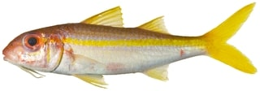{width=250px} {height=26px width=20px} [Female](Scale_Mulloidichthys martinicus_F.html) / [Male](Scale_Mulloidichthys martinicus_M.html) {height=26px width=20px}

\

<h2>*Mullus surmuletus* / Red mullet</h2>

{width=250px} {height=26px width=20px} [Female](Scale_Mullus surmuletus_F.html) / [Male](Scale_Mullus surmuletus_M.html) {height=26px width=20px}

\

<h2>*Lophius sp.* / Anglefish</h2>

{width=250px} {height=26px width=20px} [Female](Scale_Lophius sp._F.html) / [Male](Scale_Lophius sp._M.html) {height=26px width=20px}

\

<h2>*Ocyurus chrysurus* / Yellowtail snapper</h2>

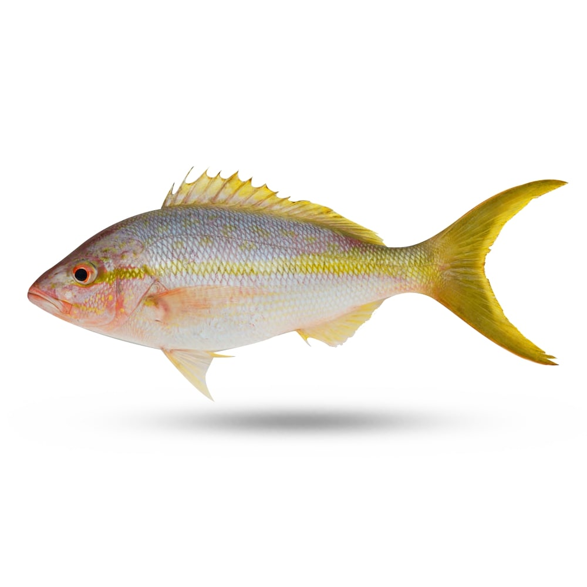{width=250px} {height=26px width=20px} [Female](Scale_Ocyurus chrysurus_F.html) / [Male](Scale_Ocyurus chrysurus_M.html) {height=26px width=20px}

\

<h2>*Pagellus bogaraveo* / Sea bream</h2>

{width=250px} {height=26px width=20px} [Female](Scale_Pagellus bogaraveo_F.html) / [Male](Scale_Pagellus bogaraveo_M.html) {height=26px width=20px}

\

<h2>*Priacanthus arenatus* / Atlantic bigeye</h2>

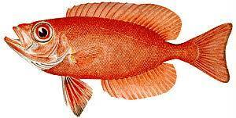{width=250px} {height=26px width=20px} [Female](Scale_Priacanthus arenatus_F.html) / [Male](Scale_Priacanthus arenatus_M.html) {height=26px width=20px}

\

<h2>*Pseudupeneus maculatus* / Spotted goatfish</h2>

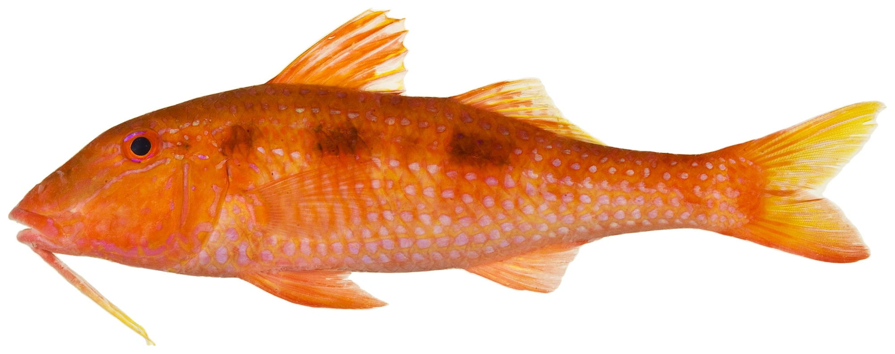{width=250px} {height=26px width=20px} [Female](Scale_Pseudupeneus maculatus_F.html) / [Male](Scale_Pseudupeneus maculatus_M.html) {height=26px width=20px}

\

<h2>*Pterois volitans* / Red lionfish</h2>

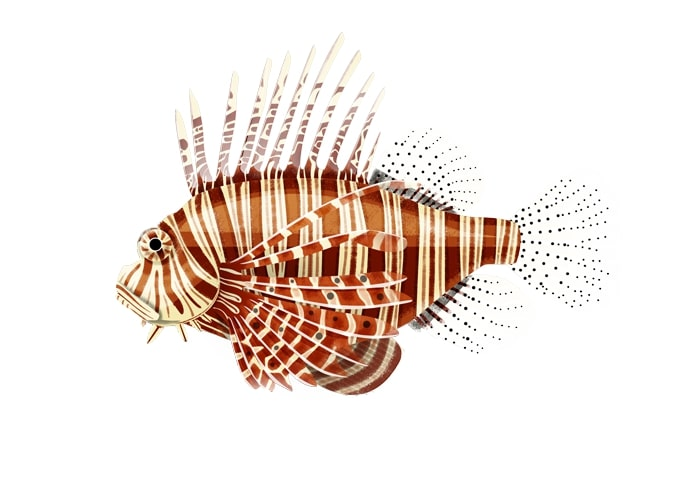{width=250px} {height=26px width=20px} [Female](Scale_Pterois volitans._F.html) / [Male](Scale_Pterois volitans_M.html) {height=26px width=20px}

\

<h2>*Sardina pilchardus* / Sardine</h2>

{width=250px} {height=26px width=20px} [Female](Scale_Sardina pilchardus_F.html) / [Male](Scale_Sardina pilchardus_M.html) {height=26px width=20px}

\

<h2>*Scomber scombrus* / Mackerel</h2>

{width=250px} {height=26px width=20px} [Female](Scale_Scomber scombrus_F.html) / [Male](Scale_Scomber scombrus_M.html) {height=26px width=20px}

\

<h2>*Scophthalmus sp.* / Brill & Turbot</h2>

{width=250px} {height=26px width=20px} [Female](Scale_Scophthalmus sp._F.html) / [Male](Scale_Scophthalmus sp._M.html) {height=26px width=20px}

\

<h2>*Solea solea* / Sole</h2>

{width=250px} {height=26px width=20px} [Female](Scale_Solea solea_F.html) / [Male](Scale_Solea solea_M.html) {height=26px width=20px}

\

<h2>*Sparisoma sp.* / Parrotfish</h2>

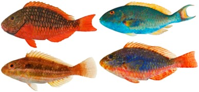{width=250px} {height=26px width=20px} [Female](Scale_Sparisoma sp._F.html) / [Male](Scale_Sparisoma sp._M.html) {height=26px width=20px}

\

<h2>*Sprattus sprattus* / Sprat</h2>

{width=250px} {height=26px width=20px} [Female](Scale_Sprattus sprattus_F.html) / [Male](Scale_Sprattus sprattus_M.html) {height=26px width=20px}

:::
::: {.column width="10%"}

\

:::
::::::::::::::

\

\

Anna LE MELEDER  
IFREMER / RBE-HMMN-LRHPB

</body>
</html>
