```{r , include=FALSE}
#If new species were to be added, here is the template section that must be added to the script to have access to this new species identification guide in the GitHub pages (text to change will be surrounded by "!" ) : 

#<h2>*!Scientific name!* / !Vernacular name!</h2>

#{width=250px} {height=26px width=20px} [Femelle](Echelle_!Scientific name!_F.html){target="_blank"} / [Mâle](Echelle_!Scientific name!_M.html){target="_blank"} {height=26px width=20px}
```

<html>
<head>
<style media="all"> 
  body {
        /* to centre page on screen*/
        margin-left: auto;
        margin-right: auto;
        font-family: sans-serif;
        font-size: 20pt;
    }
    h1{
    color:white;
    font-size:30px;
    background-color:#4775D1;
    font-weight:700;
    text-align: center;
    }
    h2{
    font-size:25px;
    background-color:#E6E6FF;
    font-weight:600;
    }
    h3{
    color:red;
    font-size:20px;
    font-weight:1000;
    font-weight: bold;
    }
    hr{
    color:#4775D1;
    height:8px;
    background-color:#4775D1;
    }
    h4{
    font-size:14px;
    color:black;
    }
    p{
    font-size:
    17px;
    }
    </style>

<title>Page Title</title>
</head>
<body>
<h1>MATURITY SCALE INDEX</h1>
<center>
<h4>*Last update : 13/09/2022*</h4>
</center>

:::::::::::::: {.columns}
::: {.column width="10%"}

\

:::
::: {.column width="80%"}

<center>
<h2>*Argyrosomus regius* / Meagre</h2>
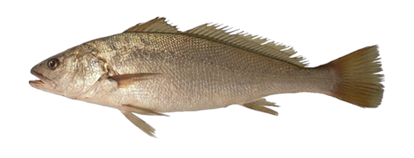{width=250px} {height=26px width=20px} [Female](Scale_Argyrosomus regius_F.html){target="_blank"} / [Male](Scale_Argyrosomus regius_M.html){target="_blank"} {height=26px width=20px}

\
<h2>*Chelidonichthys cuculus* / Red gurnard</h2>
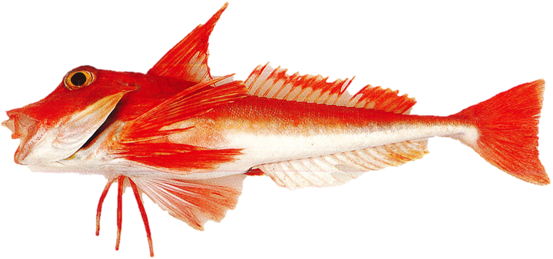{width=250px} {height=26px width=20px} [Female](Scale_Chelidonichthys cuculus_F.html){target="_blank"} / [Male](Scale_Chelidonichthys cuculus_M.html){target="_blank"} {height=26px width=20px}

\
<h2>*Clupea clupea* / Herring</h2>
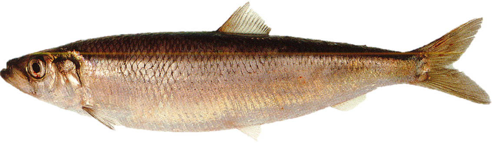{width=250px} {height=26px width=20px} [Female](Scale_Clupea clupea_F.html){target="_blank"} / [Male](Scale_Clupea clupea_M.html){target="_blank"} {height=26px width=20px}

\
<h2>*Engraulis encrasicolus* / Anchovy</h2>
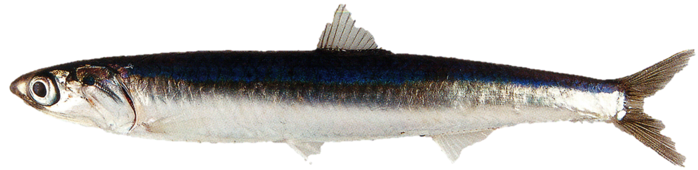{width=250px} {height=26px width=20px} [Female](Scale_Engraulis encrasicolus_F.html){target="_blank"} / [Male](Scale_Engraulis encrasicolus_M.html){target="_blank"} {height=26px width=20px}

\
<h2>*Dicentrarchus labrax* / Sea bass</h2>
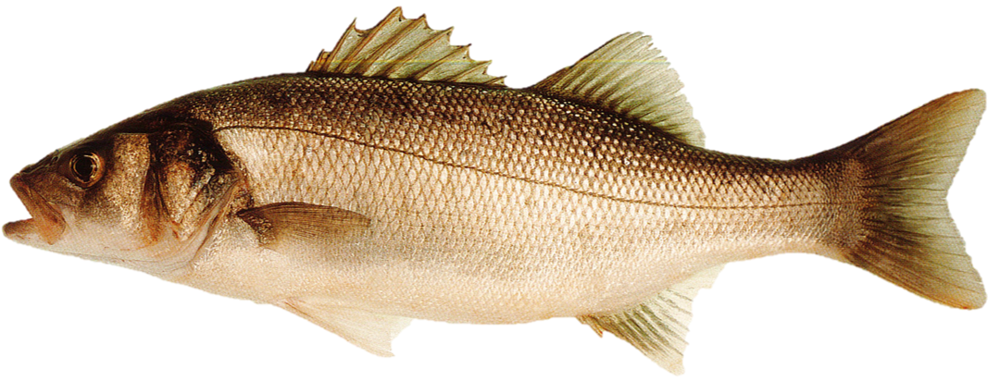{width=250px} {height=26px width=20px} [Female](Scale_Dicentrarchus labrax_F.html){target="_blank"} / [Male](Scale_Dicentrarchus labrax_M.html){target="_blank"} {height=26px width=20px}

\
<h2>*Flat fish sp.* / Flat fish</h2>
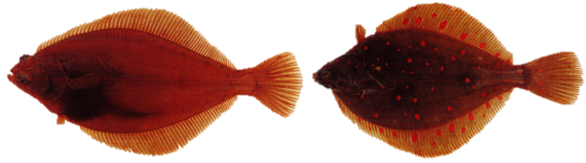{width=250px} {height=26px width=20px} [Female](Scale_Flat fish sp._F.html){target="_blank"} / [Male](Scale_Flat fish sp._M.html){target="_blank"} {height=26px width=20px}

\
<h2>*Gadidae sp.* / Gadidae</h2>
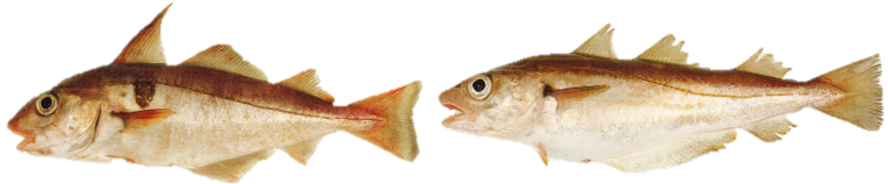{width=250px} {height=26px width=20px} [Female](Scale_Gadidae sp._F.html){target="_blank"} / [Male](Scale_Gadidae sp._M.html){target="_blank"} {height=26px width=20px}

\
<h2>*Merluccius merluccius* / Hake</h2>
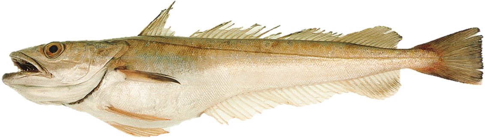{width=250px} {height=26px width=20px} [Female](Scale_Merluccius merluccius_F.html){target="_blank"} / [Male](Scale_Merluccius merluccius_M.html){target="_blank"} {height=26px width=20px}

\
<h2>*Mullus surmuletus* / Red mullet</h2>
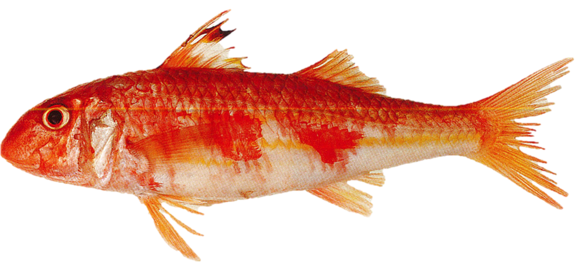{width=250px} {height=26px width=20px} [Female](Scale_Mullus surmuletus_F.html){target="_blank"} / [Male](Scale_Mullus surmuletus_M.html){target="_blank"} {height=26px width=20px}

\
<h2>*Lophius sp.* / Anglefish</h2>
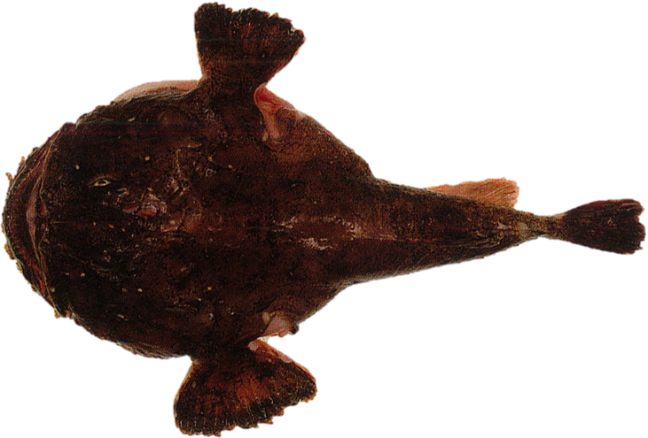{width=250px} {height=26px width=20px} [Female](Scale_Lophius sp._F.html){target="_blank"} / [Male](Scale_Lophius sp._M.html){target="_blank"} {height=26px width=20px}

\
<h2>*Pagellus bogaraveo* / Sea bream</h2>
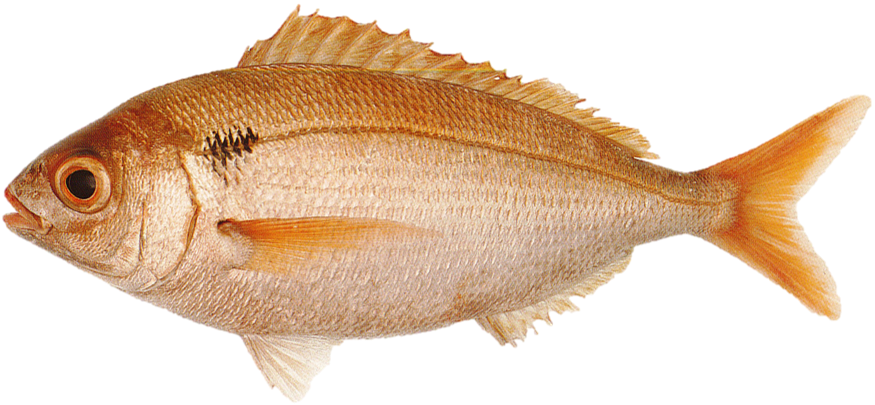{width=250px} {height=26px width=20px} [Female](Scale_Pagellus bogaraveo_F.html){target="_blank"} / [Male](Scale_Pagellus bogaraveo_M.html){target="_blank"} {height=26px width=20px}

\
<h2>*Sardina pilchardus* / Sardine</h2>
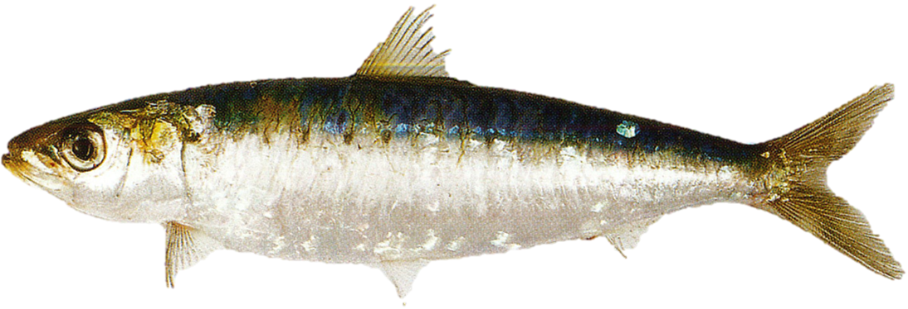{width=250px} {height=26px width=20px} [Female](Scale_Sardina pilchardus_F.html){target="_blank"}  / [Male](Scale_Sardina pilchardus_M.html){target="_blank"}  {height=26px width=20px}

\
<h2>*Scomber scombrus* / Mackerel</h2>
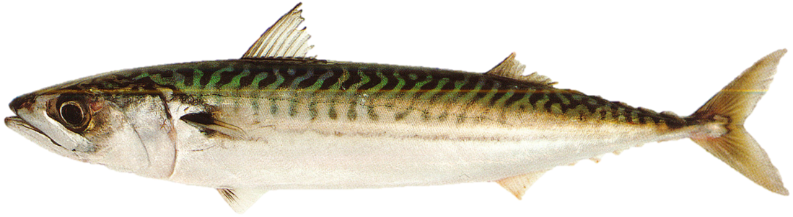{width=250px} {height=26px width=20px} [Female](Scale_Scomber scombrus_F.html){target="_blank"}  / [Male](Scale_Scomber scombrus_M.html){target="_blank"}  {height=26px width=20px}

\
<h2>*Scophthalmus sp.* / Brill & Turbot</h2>
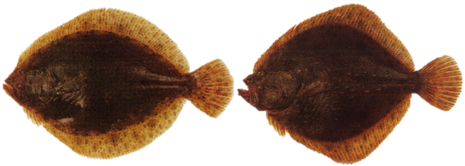{width=250px} {height=26px width=20px} [Female](Scale_Scophthalmus sp._F.html){target="_blank"}  / [Male](Scale_Scophthalmus sp._M.html){target="_blank"}  {height=26px width=20px}

\
<h2>*Solea solea* / Sole</h2>
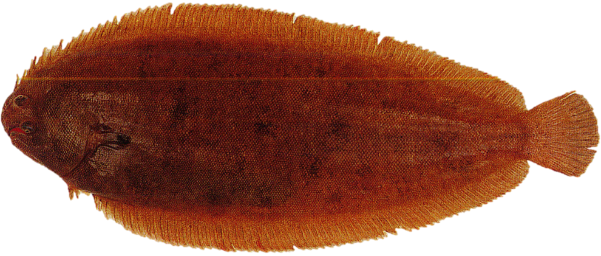{width=250px} {height=26px width=20px} [Female](Scale_Solea solea_F.html){target="_blank"}  / [Male](Scale_Solea solea_M.html){target="_blank"}  {height=26px width=20px}

\
<h2>*Sprattus sprattus* / Sprat</h2>
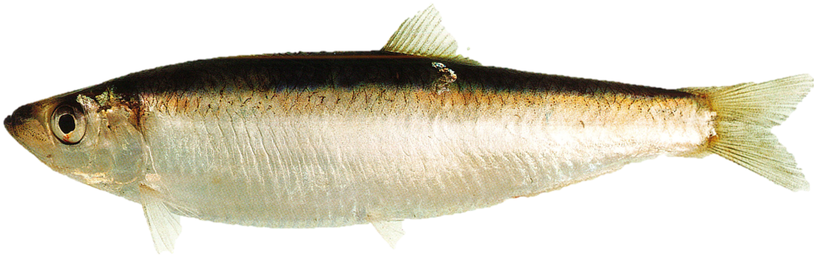{width=250px} {height=26px width=20px} [Female](Scale_Sprattus sprattus_F.html){target="_blank"}  / [Male](Scale_Sprattus sprattus_M.html){target="_blank"}  {height=26px width=20px}

</center>

:::
::: {.column width="10%"}

\

:::
::::::::::::::

\
<center>
{height=26px width=20px} <a href="#" onclick="history.go(-1)" style="color:black;font-size:20px;">Go back</a>
</center>
\
\
Anna LE MELEDER  
IFREMER / RBE-HMMN-LRHPB  
Quéro J-C. et Vayne J-J.2008. Les poissons de mer des pêches françaises : delachaux et niestlé, 304

</body>
</html>
