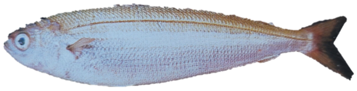
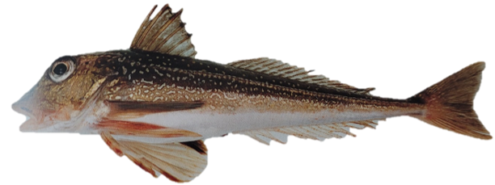
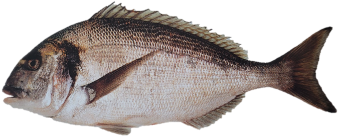
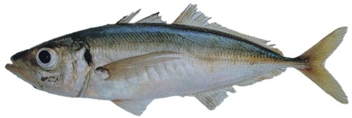
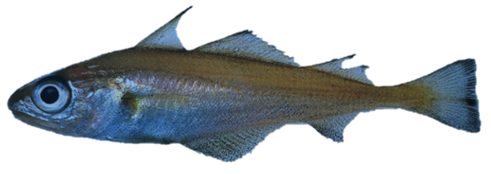

```{r , include=FALSE}
#If new species were to be added, here is the template section that must be added to the script to have access to this new species identification guide in the GitHub pages (text to change will be surrounded by "!" ) : 

#<h2>*!Scientific name!* / !Vernacular name!</h2>

#{width=250px} {height=26px width=20px} [Femelle](Echelle_!Scientific name!_F.html){target="_blank"} / [Mâle](Echelle_!Scientific name!_M.html){target="_blank"} {height=26px width=20px}
```

<html>
<head>
<style media="all"> 
  body {
        /* to centre page on screen*/
        margin-left: auto;
        margin-right: auto;
        font-family: sans-serif;
        font-size: 20pt;
    }
    h1{
    color:white;
    font-size:30px;
    background-color:#4775D1;
    font-weight:700;
    text-align: center;
    }
    h2{
    font-size:25px;
    background-color:#E6E6FF;
    font-weight:600;
    }
    h3{
    color:red;
    font-size:20px;
    font-weight:1000;
    font-weight: bold;
    }
    hr{
    color:#4775D1;
    height:8px;
    background-color:#4775D1;
    }
    h4{
    font-size:14px;
    color:black;
    }
    p{
    font-size:
    17px;
    }
    </style>

<title>Page Title</title>
</head>
<body>
<h1>MATURITY SCALE INDEX</h1>
<center>
<h4>*Last update : 10/07/2023*</h4>
</center>

:::::::::::::: {.columns}
::: {.column width="10%"}

\

:::
::: {.column width="80%"}

<center>
<h2>*Boops boops* / Bogue</h2>
{width=250px} {height=26px width=20px} [Female](Scale_Boops boops_F.html){target="_blank"} / [Male](Scale_Boops boops_M.html){target="_blank"} {height=26px width=20px}

\
<h2>*Chelidonichthys cuculus* / Red gurnard</h2>
{width=250px} {height=26px width=20px} [Female](Scale_Chelidonichthys cuculus_F.html){target="_blank"} / [Male](Scale_Chelidonichthys cuculus_M.html){target="_blank"} {height=26px width=20px}

\
<h2>*Eutrigla gurnardus* / Grey gurnard</h2>
{width=250px} {height=26px width=20px} [Female](Scale_Eutrigla gurnardus_F.html){target="_blank"} / [Male](Scale_Eutrigla gurnardus_M.html){target="_blank"} {height=26px width=20px}

\
<h2>*Gadidae sp.* / Gadidae</h2>
{width=250px} {height=26px width=20px} [Female](Scale_Gadidae sp._F.html){target="_blank"} / [Male](Scale_Gadidae sp._M.html){target="_blank"} {height=26px width=20px}

\
<h2>*Merluccius merluccius* / Hake</h2>
{width=250px} {height=26px width=20px} [Female](Scale_Merluccius merluccius_F.html){target="_blank"} / [Male](Scale_Merluccius merluccius_M.html){target="_blank"} {height=26px width=20px}

\
<h2>*Mullus sp.* / Red mullet</h2>
{width=250px} {height=26px width=20px} [Female](Scale_Mullus sp._F.html){target="_blank"} / [Male](Scale_Mullus sp._M.html){target="_blank"} {height=26px width=20px}

\
<h2>*Lophius sp.* / Anglefish</h2>
{width=250px} {height=26px width=20px} [Female](Scale_Lophius sp._F.html){target="_blank"} / [Male](Scale_Lophius sp._M.html){target="_blank"} {height=26px width=20px}

\
<h2>*Pagellus bogaraveo* / Sea bream</h2>
{width=250px} {height=26px width=20px} [Female](Scale_Pagellus bogaraveo_F.html){target="_blank"} / [Male](Scale_Pagellus bogaraveo_M.html){target="_blank"} {height=26px width=20px}

\
<h2>*Scomber scombrus* / Mackerel</h2>
{width=250px} {height=26px width=20px} [Female](Scale_Scomber scombrus_F.html){target="_blank"} / [Male](Scale_Scomber scombrus_M.html){target="_blank"} {height=26px width=20px}

\
<h2>*Sparus aurata* / Gilt-head bream</h2>
{width=250px} {height=26px width=20px} [Female](Scale_Sparus aurata_F.html){target="_blank"} / [Male](Scale_Sparus aurata_M.html){target="_blank"} {height=26px width=20px}

\
<h2>*Trachurus sp.* / Horse mackerel</h2>
{width=250px} {height=26px width=20px} [Female](Scale_Trachurus sp._F.html){target="_blank"} / [Male](Scale_Trachurus sp._M.html){target="_blank"} {height=26px width=20px}

\
<h2>*Trisopterus minutus* / Poor-cod</h2>
{width=250px} {height=26px width=20px} [Female](Scale_Trisopterus minutus_F.html){target="_blank"} / [Male](Scale_Trisopterus minutus_M.html){target="_blank"} {height=26px width=20px}

</center>

:::
::: {.column width="10%"}

\

:::
::::::::::::::

\
<center>
{height=26px width=20px} <a href="#" onclick="history.go(-1)" style="color:black;font-size:20px;">Go back</a>
</center>
\
\
Anna LE MELEDER  
IFREMER / RBE-HMMN-LRHPB  
Quéro J-C. et Vayne J-J.2008. Les poissons de mer des pêches françaises : delachaux et niestlé, 304

</body>
</html>
