```{r , include=FALSE}
#If new species were to be added, here is the template section that must be added to the script to have access to this new species identification guide in the GitHub pages (text to change will be surrounded by "!" ) : 

#<h2>*!Scientific name!* / !Vernacular name!</h2>

#{width=250px} {height=26px width=20px} [Femelle](Echelle_!Scientific name!_F.html){target="_blank"} / [Mâle](Echelle_!Scientific name!_M.html){target="_blank"} {height=26px width=20px}
```

<html>
<head>
<style media="all"> 
  body {
        /* to centre page on screen*/
        margin-left: auto;
        margin-right: auto;
        font-family: sans-serif;
        font-size: 20pt;
    }
    h1{
    color:white;
    font-size:30px;
    background-color:#4775D1;
    font-weight:700;
    text-align: center;
    }
    h2{
    font-size:25px;
    background-color:#E6E6FF;
    font-weight:600;
    }
    h3{
    color:red;
    font-size:20px;
    font-weight:1000;
    font-weight: bold;
    }
    hr{
    color:#4775D1;
    height:8px;
    background-color:#4775D1;
    }
    h4{
    font-size:14px;
    color:black;
    }
    p{
    font-size:
    17px;
    }
    </style>

<title>Page Title</title>
</head>
<body>
<h1>MATURITY SCALE INDEX</h1>
<center>
<h4>*Last update : 09/09/2022*</h4>
</center>

:::::::::::::: {.columns}
::: {.column width="10%"}

\

:::
::: {.column width="80%"}

<center>
<h2>*Acanthostracion sp.* / Cowfish</h2>
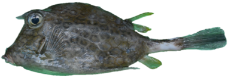{width=250px} {height=26px width=20px} [Female](Scale_Acanthostracion sp._F.html){target="_blank"} / [Male](Scale_Acanthostracion sp._M.html){target="_blank"} {height=26px width=20px}

\
<h2>*Acanthurus sp.* / Surgeonfish</h2>
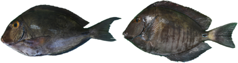{width=250px} {height=26px width=20px} [Female](Scale_Acanthurus sp._F.html){target="_blank"} / [Male](Scale_Acanthurus sp._M.html){target="_blank"} {height=26px width=20px}

\
<h2>*Aluterus scriptus* / Scribbled leatherjacket filefish</h2>
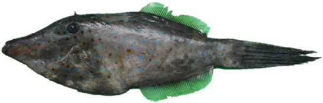{width=250px} {height=26px width=20px} [Female](Scale_Aluterus scriptus_F.html){target="_blank"} / [Male](Scale_Aluterus scriptus_M.html){target="_blank"} {height=26px width=20px}

\
<h2>*Balistes vetula* / Queen triggerfish</h2>
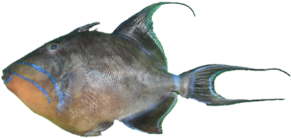{width=250px} {height=26px width=20px} [Female](Scale_Balistes vetula_F.html){target="_blank"} / [Male](Scale_Balistes vetula_M.html){target="_blank"} {height=26px width=20px}

\
<h2>*Calamus bajonado* / Jolthead porgy</h2>
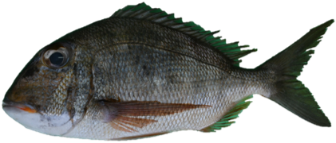{width=250px} {height=26px width=20px} [Female](Scale_Calamus bajonado_F.html){target="_blank"} / [Male](Scale_Calamus bajonado_M.html){target="_blank"} {height=26px width=20px}

\
<h2>*Cantherhines macrocerus* / American whitespotted filefish</h2>
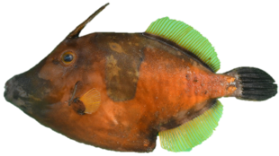{width=250px} {height=26px width=20px} [Female](Scale_Cantherhines macrocerus_F.html){target="_blank"} / [Male](Scale_Cantherhines macrocerus_M.html){target="_blank"} {height=26px width=20px}

\
<h2>*Canthidermis sufflamen* / Ocean triggerfish</h2>
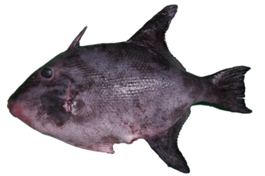{width=250px} {height=26px width=20px} [Female](Scale_Canthidermis sufflamen_F.html){target="_blank"} / [Male](Scale_Canthidermis sufflamen_M.html){target="_blank"} {height=26px width=20px}

\
<h2>*Caranx sp.* / Jack</h2>
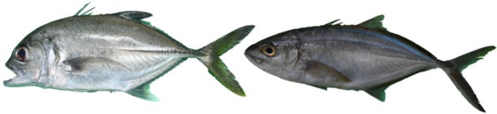{width=250px} {height=26px width=20px} [Female](Scale_Caranx sp._F.html){target="_blank"} / [Male](Scale_Caranx sp._M.html){target="_blank"} {height=26px width=20px}

\
<h2>*Epinephelinae sp.* / Grouper</h2>
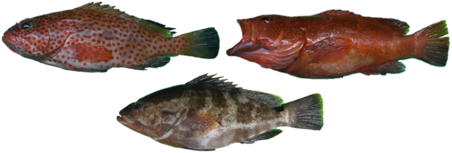{width=250px} {height=26px width=20px} [Female](Scale_Epinephelinae sp._F.html){target="_blank"} / [Male](Scale_Epinephelinae sp._M.html){target="_blank"} {height=26px width=20px}

\
<h2>*Etelis oculatus* / Queen snapper</h2>
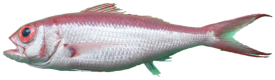{width=250px} {height=26px width=20px} [Female](Scale_Etelis oculatus_F.html){target="_blank"} / [Male](Scale_Etelis oculatus_M.html){target="_blank"} {height=26px width=20px}

\
<h2>*Haemulon sp.* / Grunt</h2>
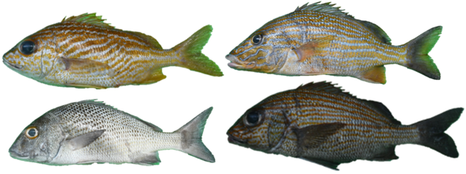{width=250px} {height=26px width=20px} [Female](Scale_Haemulon sp._F.html){target="_blank"} / [Male](Scale_Haemulon sp._M.html){target="_blank"} {height=26px width=20px}

\
<h2>*Lutjanus sp.* / Snapper</h2>
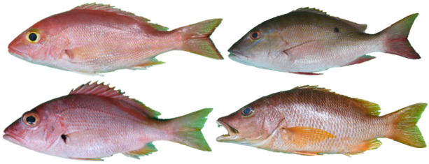{width=250px} {height=26px width=20px} [Female](Scale_Lutjanus sp._F.html){target="_blank"} / [Male](Scale_Lutjanus sp._M.html){target="_blank"} {height=26px width=20px}

\
<h2>*Mulloidichthys martinicus* / Yellow goatfish</h2>
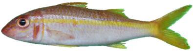{width=250px} {height=26px width=20px} [Female](Scale_Mulloidichthys martinicus_F.html){target="_blank"} / [Male](Scale_Mulloidichthys martinicus_M.html){target="_blank"} {height=26px width=20px}

\
<h2>*Ocyurus chrysurus* / Yellowtail snapper</h2>
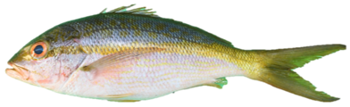{width=250px} {height=26px width=20px} [Female](Scale_Ocyurus chrysurus_F.html){target="_blank"} / [Male](Scale_Ocyurus chrysurus_M.html){target="_blank"} {height=26px width=20px}

\
<h2>*Priacanthus arenatus* / Atlantic bigeye</h2>
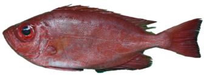{width=250px} {height=26px width=20px} [Female](Scale_Priacanthus arenatus_F.html){target="_blank"} / [Male](Scale_Priacanthus arenatus_M.html){target="_blank"} {height=26px width=20px}

\
<h2>*Pseudupeneus maculatus* / Spotted goatfish</h2>
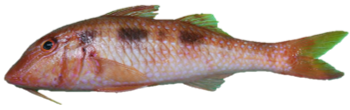{width=250px} {height=26px width=20px} [Female](Scale_Pseudupeneus maculatus_F.html){target="_blank"} / [Male](Scale_Pseudupeneus maculatus_M.html){target="_blank"} {height=26px width=20px}

\
<h2>*Pterois volitans* / Red lionfish</h2>
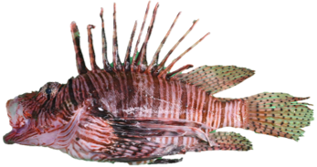{width=250px} {height=26px width=20px} [Female](Scale_Pterois volitans_F.html){target="_blank"} / [Male](Scale_Pterois volitans_M.html){target="_blank"} {height=26px width=20px}

\
<h2>*Sparisoma sp.* / Parrotfish</h2>
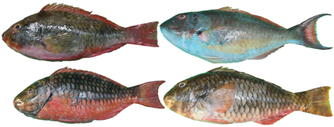{width=250px} {height=26px width=20px} [Female](Scale_Sparisoma sp._F.html){target="_blank"} / [Male](Scale_Sparisoma sp._M.html){target="_blank"} {height=26px width=20px}

</center>

:::
::: {.column width="10%"}

\

:::
::::::::::::::

\
<center>
{height=26px width=20px} <a href="#" onclick="history.go(-1)" style="color:black;font-size:20px;">Go back</a>
</center>
\
\
Anna LE MELEDER  
IFREMER / RBE-HMMN-LRHPB

</body>
</html>
