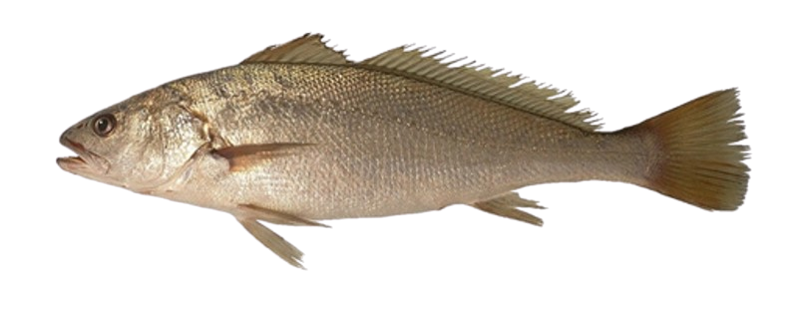
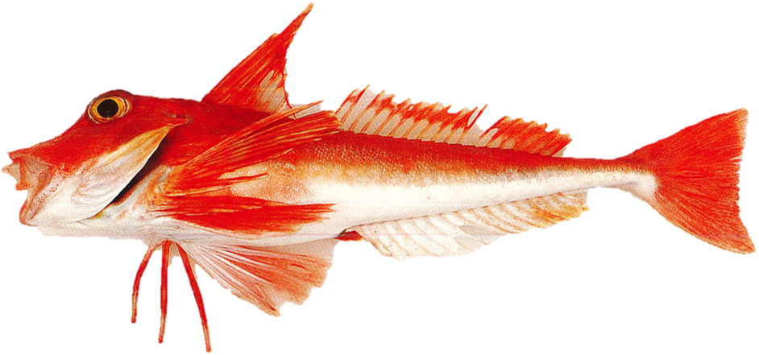
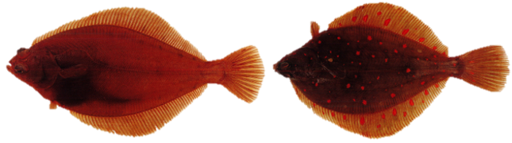
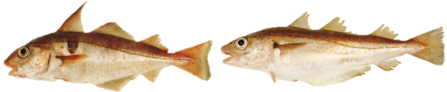
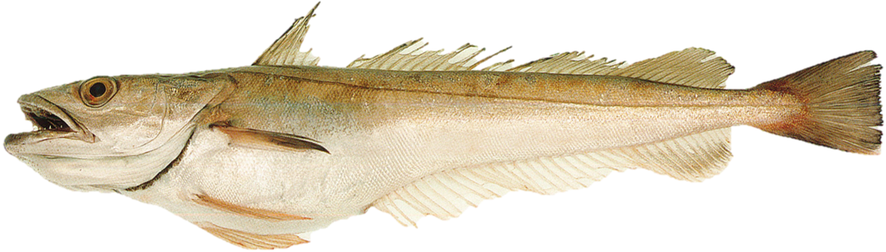
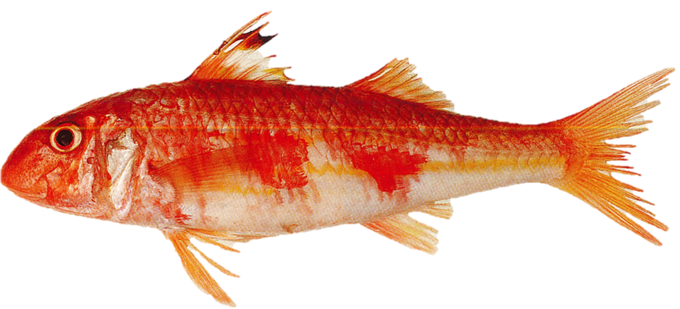
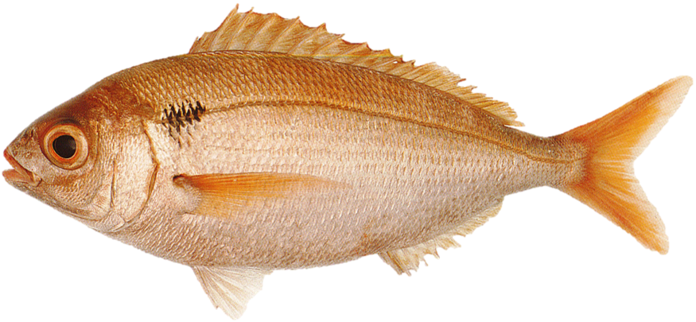
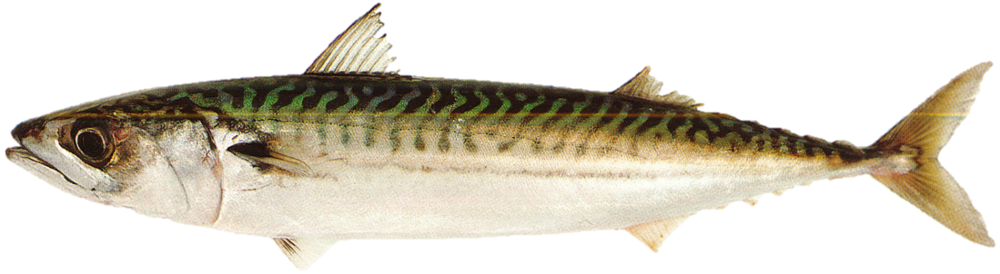

<html>
<head>

<title>Page Title</title>

</head>

<body>

<h1>MATURITY SCALE INDEX</h1>

<h4>*Last update : 04/08/2022*</h4>

:::::::::::::: {.columns}
::: {.column width="10%"}

\

:::
::: {.column width="80%"}

<h2>*Argyrosomus regius* / Meagre</h2>

{width=250px} {height=26px width=20px} [Female](Scale_Argyrosomus regius_F.pdf){target="_blank"} / [Male](Scale_Argyrosomus regius_M.pdf){target="_blank"} {height=26px width=20px}

\

<h2>*Chelidonichthys cuculus* / Red gurnard</h2>

{width=250px} {height=26px width=20px} [Female](Scale_Chelidonichthys cuculus_F.pdf){target="_blank"} / [Male](Scale_Chelidonichthys cuculus_M.pdf){target="_blank"} {height=26px width=20px}

\

<h2>*Clupea clupea* / Herring</h2>

{width=250px} {height=26px width=20px} [Female](Scale_Clupea clupea_F.pdf){target="_blank"} / [Male](Scale_Clupea clupea_M.pdf){target="_blank"} {height=26px width=20px}

\

<h2>*Engraulis encrasicolus* / Anchovy</h2>

{width=250px} {height=26px width=20px} [Female](Scale_Engraulis encrasicolus_F.pdf){target="_blank"} / [Male](Scale_Engraulis encrasicolus_M.pdf){target="_blank"} {height=26px width=20px}

\

<h2>*Dicentrarchus labrax* / Sea bass</h2>

{width=250px} {height=26px width=20px} [Female](Scale_Dicentrarchus labrax_F.pdf){target="_blank"} / [Male](Scale_Dicentrarchus labrax_M.pdf){target="_blank"} {height=26px width=20px}

\

<h2>*Flat fish sp.* / Flat fish</h2>

{width=250px} {height=26px width=20px} [Female](Scale_Flat fish sp._F.pdf){target="_blank"} / [Male](Scale_Flat fish sp._M.pdf){target="_blank"} {height=26px width=20px}

\

<h2>*Gadidae sp.* / Gadidae</h2>

{width=250px} {height=26px width=20px} [Female](Scale_Gadidae sp._F.pdf){target="_blank"} / [Male](Scale_Gadidae sp._M.pdf){target="_blank"} {height=26px width=20px}

\

<h2>*Merluccius merluccius* / Hake</h2>

{width=250px} {height=26px width=20px} [Female](Scale_Merluccius merluccius_F.pdf){target="_blank"} / [Male](Scale_Merluccius merluccius_M.pdf){target="_blank"} {height=26px width=20px}

\

<h2>*Mullus surmuletus* / Red mullet</h2>

{width=250px} {height=26px width=20px} [Female](Scale_Mullus surmuletus_F.pdf){target="_blank"} / [Male](Scale_Mullus surmuletus_M.pdf){target="_blank"} {height=26px width=20px}

\

<h2>*Lophius sp.* / Anglefish</h2>

{width=250px} {height=26px width=20px} [Female](Scale_Lophius sp._F.pdf){target="_blank"} / [Male](Scale_Lophius sp._M.pdf){target="_blank"} {height=26px width=20px}

\

<h2>*Pagellus bogaraveo* / Sea bream</h2>

{width=250px} {height=26px width=20px} [Female](Scale_Pagellus bogaraveo_F.pdf){target="_blank"} / [Male](Scale_Pagellus bogaraveo_M.pdf){target="_blank"} {height=26px width=20px}

\

<h2>*Sardina pilchardus* / Sardine</h2>

{width=250px} {height=26px width=20px} [Female](Scale_Sardina pilchardus_F.pdf){target="_blank"} / [Male](Scale_Sardina pilchardus_M.pdf){target="_blank"} {height=26px width=20px}

\

<h2>*Scomber scombrus* / Mackerel</h2>

{width=250px} {height=26px width=20px} [Female](Scale_Scomber scombrus_F.pdf){target="_blank"} / [Male](Scale_Scomber scombrus_M.pdf){target="_blank"} {height=26px width=20px}

\

<h2>*Scophthalmus sp.* / Brill & Turbot</h2>

{width=250px} {height=26px width=20px} [Female](Scale_Scophthalmus sp._F.pdf){target="_blank"} / [Male](Scale_Scophthalmus sp._M.pdf){target="_blank"} {height=26px width=20px}

\

<h2>*Solea solea* / Sole</h2>

{width=250px} {height=26px width=20px} [Female](Scale_Solea solea_F.pdf){target="_blank"} / [Male](Scale_Solea solea_M.pdf){target="_blank"} {height=26px width=20px}

\

<h2>*Sprattus sprattus* / Sprat</h2>

{width=250px} {height=26px width=20px} [Female](Scale_Sprattus sprattus_F.pdf{target="_blank"}) / [Male](Scale_Sprattus sprattus_M.pdf){target="_blank"} {height=26px width=20px}

:::
::: {.column width="10%"}

\

:::
::::::::::::::

\

{height=26px width=20px} <a href="#" onclick="history.go(-1)" style="color:black;font-size:20px;">Go back</a>

\

\

Anna LE MELEDER  
IFREMER / RBE-HMMN-LRHPB

</body>
</html>
