<html>
<head>

<title>Page Title</title>

</head>

<body>

<h1>INDEX ÉCHELLE DE MATURITÉ</h1>

<h4>*Dernière mise à jour : 29/04/2022*</h4>

:::::::::::::: {.columns}
::: {.column width="10%"}

\

:::
::: {.column width="80%"}

<h2>*Argyrosomus regius* / Maigre</h2>

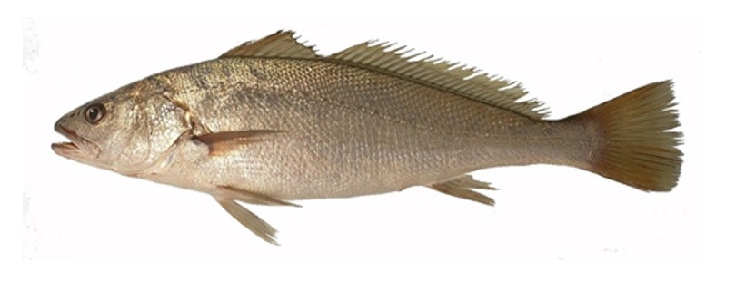{width=250px} {height=26px width=20px} [Female](Echelle_Argyrosomus regius_F.pdf) / [Male](Echelle_Argyrosomus regius_M.pdf) {height=26px width=20px}

\

<h2>*Chelidonichthys cuculus* / Grondin rouge</h2>

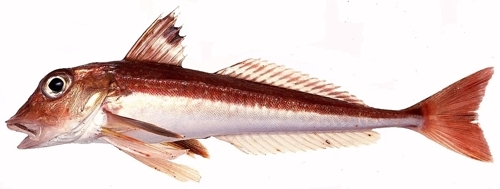{width=250px} {height=26px width=20px} [Femelle](Echelle_Chelidonichthys cuculus_F.pdf) / [Male](Echelle_Chelidonichthys cuculus_M.pdf) {height=26px width=20px}

\

<h2>*Clupea clupea* / Hareng</h2>

{width=250px} {height=26px width=20px} [Femelle](Echelle_Clupea clupea_F.pdf) / [Male](Echelle_Clupea clupea_M.pdf) {height=26px width=20px}

\

<h2>*Engraulis encrasicolus* / Anchois</h2>

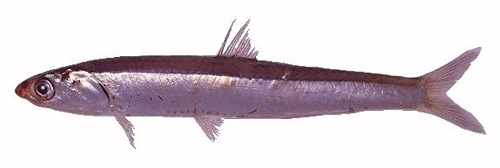{width=250px} {height=26px width=20px} [Femelle](Echelle_Engraulis encrasicolus_F.pdf) / [Male](Echelle_Engraulis encrasicolus_M.pdf) {height=26px width=20px}

\

<h2>*Dicentrarchus labrax* / Bar</h2>

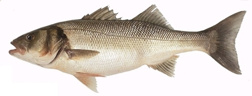{width=250px} {height=26px width=20px} [Femelle](Echelle_Dicentrarchus labrax_F.pdf) / [Male](Echelle_Dicentrarchus labrax_M.pdf) {height=26px width=20px}

\

<h2>*Gadidae sp.* / Gadidae</h2>

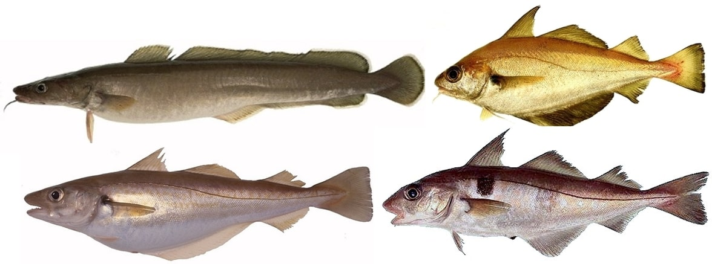{width=250px} {height=26px width=20px} [Femelle](Echelle_Gadidae sp._F.pdf) / [Male](Echelle_Gadidae sp._M.pdf) {height=26px width=20px}

\

<h2>*Flat fish sp.* / Poissons plats</h2>

{width=250px} {height=26px width=20px} [Femelle](Echelle_Flat fish sp._F.pdf) / [Male](Echelle_Flat fish sp._M.pdf) {height=26px width=20px}

\

<h2>*Merluccius merluccius* / Merlu</h2>

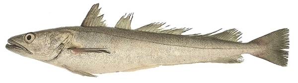{width=250px} {height=26px width=20px} [Femelle](Echelle_Merluccius merluccius_F.pdf) / [Male](Echelle_Merluccius merluccius_M.pdf) {height=26px width=20px}

\

<h2>*Mullus surmuletus* / Rouget barbet de roche</h2>

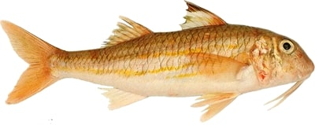{width=250px} {height=26px width=20px} [Femelle](Echelle_Mullus surmuletus_F.pdf) / [Male](Echelle_Mullus surmuletus_M.pdf) {height=26px width=20px}

\

<h2>*Lophius sp.* / Baudroie</h2>

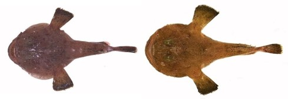{width=250px} {height=26px width=20px} [Femelle](Echelle_Lophius sp._F.pdf) / [Male](Echelle_Lophius sp._M.pdf) {height=26px width=20px}

\

<h2>*Pagellus bogaraveo* / Dorade rose</h2>

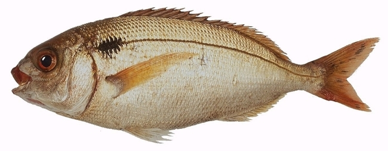{width=250px} {height=26px width=20px} [Femelle](Echelle_Pagellus bogaraveo_F.pdf) / [Male](Echelle_Pagellus bogaraveo_M.pdf) {height=26px width=20px}

\

<h2>*Sardina pilchardus* / Sardine</h2>

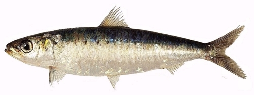{width=250px} {height=26px width=20px} [Femelle](Echelle_Sardina pilchardus_F.pdf) / [Male](Echelle_Sardina pilchardus_M.pdf) {height=26px width=20px}

\

<h2>*Scomber scombrus* / Maquereau</h2>

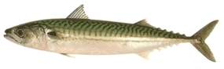{width=250px} {height=26px width=20px} [Femelle](Echelle_Scomber scombrus_F.pdf) / [Male](Echelle_Scomber scombrus_M.pdf) {height=26px width=20px}

\

<h2>*Scophthalmus sp.* / Barbue & Turbot</h2>

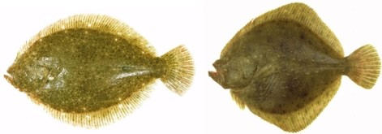{width=250px} {height=26px width=20px} [Femelle](Echelle_Scophthalmus sp._F.pdf) / [Male](Echelle_Scophthalmus sp._M.pdf) {height=26px width=20px}

\

<h2>*Solea solea* / Sole</h2>

{width=250px} {height=26px width=20px} [Femelle](Echelle_Solea solea_F.pdf) / [Male](Echelle_Solea solea_M.pdf) {height=26px width=20px}

\

<h2>*Sprattus sprattus* / Sprat</h2>

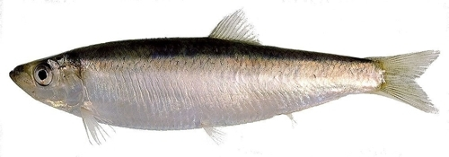{width=250px} {height=26px width=20px} [Femelle](Echelle_Sprattus sprattus_F.pdf) / [Male](Echelle_Sprattus sprattus_M.pdf) {height=26px width=20px}

:::
::: {.column width="10%"}

\

:::
::::::::::::::

\

\

Anna LE MELEDER  
IFREMER / RBE-HMMN-LRHPB

</body>
</html>
