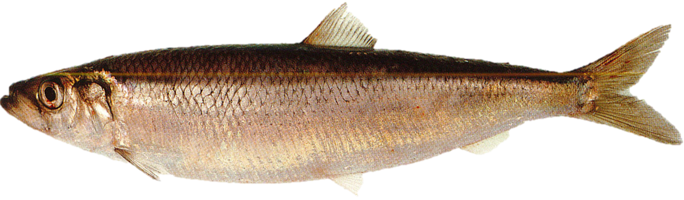
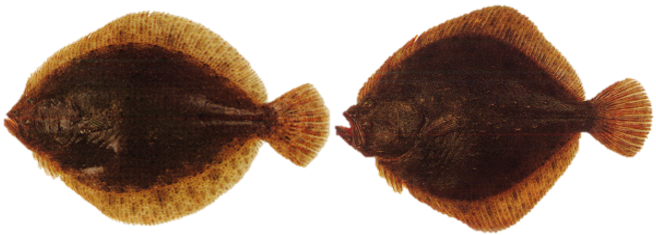

```{r , include=FALSE}
#If new species were to be added, here is the template section that must be added to the script to have access to this new species identification guide in the GitHub pages (text to change will be surrounded by "!" ) : 

#<h2>*!Scientific name!* / !Vernacular name!</h2>

#{width=250px} {height=26px width=20px} [Femelle](Echelle_!Scientific name!_F.html){target="_blank"} / [Mâle](Echelle_!Scientific name!_M.html){target="_blank"} {height=26px width=20px}
```

<html>
<head>
<style media="all"> 
  body {
        /* to centre page on screen*/
        margin-left: auto;
        margin-right: auto;
        font-family: sans-serif;
        font-size: 20pt;
    }
    h1{
    color:white;
    font-size:30px;
    background-color:#4775D1;
    font-weight:700;
    text-align: center;
    }
    h2{
    font-size:25px;
    background-color:#E6E6FF;
    font-weight:600;
    }
    h3{
    color:red;
    font-size:20px;
    font-weight:1000;
    font-weight: bold;
    }
    hr{
    color:#4775D1;
    height:8px;
    background-color:#4775D1;
    }
    h4{
    font-size:14px;
    color:black;
    }
    p{
    font-size:
    17px;
    }
    </style>

<title>Page Title</title>
</head>
<body>
<h1>INDEX ÉCHELLE DE MATURITÉ</h1>
<center>
<h4>*Dernière mise à jour : 16/05/2023*</h4>
</center>

:::::::::::::: {.columns}
::: {.column width="10%"}

\

:::
::: {.column width="80%"}

<center>
<h2>*Argyrosomus regius* / Maigre</h2>
{width=250px} {height=26px width=20px} [Femelle](Echelle_Argyrosomus regius_F.pdf){target="_blank"} / [Mâle](Echelle_Argyrosomus regius_M.pdf){target="_blank"} {height=26px width=20px}

\
<h2>*Chelidonichthys cuculus* / Grondin rouge</h2>
{width=250px} {height=26px width=20px} [Femelle](Echelle_Chelidonichthys cuculus_F.pdf){target="_blank"} / [Mâle](Echelle_Chelidonichthys cuculus_M.pdf){target="_blank"} {height=26px width=20px}

\
<h2>*Clupea clupea* / Hareng</h2>
{width=250px} {height=26px width=20px} [Femelle](Echelle_Clupea clupea_F.pdf){target="_blank"} / [Mâle](Echelle_Clupea clupea_M.pdf){target="_blank"} {height=26px width=20px}

\
<h2>*Engraulis encrasicolus* / Anchois</h2>
{width=250px} {height=26px width=20px} [Femelle](Echelle_Engraulis encrasicolus_F.pdf){target="_blank"} / [Mâle](Echelle_Engraulis encrasicolus_M.pdf){target="_blank"} {height=26px width=20px}

\
<h2>*Dicentrarchus labrax* / Bar</h2>
{width=250px} {height=26px width=20px} [Femelle](Echelle_Dicentrarchus labrax_F.pdf){target="_blank"} / [Mâle](Echelle_Dicentrarchus labrax_M.pdf){target="_blank"} {height=26px width=20px}

\
<h2>*Flat fish sp.* / Poissons plats</h2>
{width=250px} {height=26px width=20px} [Femelle](Echelle_Flat fish sp._F.pdf){target="_blank"} / [Mâle](Echelle_Flat fish sp._M.pdf){target="_blank"} {height=26px width=20px}

\
<h2>*Gadidae sp.* / Gadidae</h2>
{width=250px} {height=26px width=20px} [Femelle](Echelle_Gadidae sp._F.pdf){target="_blank"} / [Mâle](Echelle_Gadidae sp._M.pdf){target="_blank"} {height=26px width=20px}

\
<h2>*Merluccius merluccius* / Merlu</h2>
{width=250px} {height=26px width=20px} [Femelle](Echelle_Merluccius merluccius_F.pdf){target="_blank"} / [Mâle](Echelle_Merluccius merluccius_M.pdf){target="_blank"} {height=26px width=20px}

\
<h2>*Mullus surmuletus* / Rouget barbet de roche</h2>
{width=250px} {height=26px width=20px} [Femelle](Echelle_Mullus surmuletus_F.pdf){target="_blank"} / [Mâle](Echelle_Mullus surmuletus_M.pdf){target="_blank"} {height=26px width=20px}

\
<h2>*Lophius sp.* / Baudroies</h2>
{width=250px} {height=26px width=20px} [Femelle](Echelle_Lophius sp._F.pdf){target="_blank"} / [Mâle](Echelle_Lophius sp._M.pdf){target="_blank"} {height=26px width=20px}

\
<h2>*Pagellus bogaraveo* / Dorade rose</h2>
{width=250px} {height=26px width=20px} [Femelle](Echelle_Pagellus bogaraveo_F.pdf){target="_blank"} / [Mâle](Echelle_Pagellus bogaraveo_M.pdf){target="_blank"} {height=26px width=20px}

\
<h2>*Sardina pilchardus* / Sardine</h2>
{width=250px} {height=26px width=20px} [Femelle](Echelle_Sardina pilchardus_F.pdf){target="_blank"} / [Mâle](Echelle_Sardina pilchardus_M.pdf){target="_blank"} {height=26px width=20px}

\
<h2>*Scomber scombrus* / Maquereau</h2>
{width=250px} {height=26px width=20px} [Femelle](Echelle_Scomber scombrus_F.pdf){target="_blank"} / [Mâle](Echelle_Scomber scombrus_M.pdf){target="_blank"} {height=26px width=20px}

\
<h2>*Scophthalmus sp.* / Barbue & Turbot</h2>
{width=250px} {height=26px width=20px} [Femelle](Echelle_Scophthalmus sp._F.pdf){target="_blank"} / [Mâle](Echelle_Scophthalmus sp._M.pdf){target="_blank"} {height=26px width=20px}

\
<h2>*Solea solea* / Sole</h2>
{width=250px} {height=26px width=20px} [Femelle](Echelle_Solea solea_F.pdf){target="_blank"} / [Mâle](Echelle_Solea solea_M.pdf){target="_blank"} {height=26px width=20px}

\
<h2>*Sprattus sprattus* / Sprat</h2>
{width=250px} {height=26px width=20px} [Femelle](Echelle_Sprattus sprattus_F.pdf){target="_blank"} / [Mâle](Echelle_Sprattus sprattus_M.pdf){target="_blank"} {height=26px width=20px}

</center>

:::
::: {.column width="10%"}

\

:::
::::::::::::::

\
<center>
{height=26px width=20px} <a href="#" onclick="history.go(-1)" style="color:black;font-size:20px;">Retour</a>
</center>
\
\
Anna LE MELEDER  
IFREMER / RBE-HMMN-LRHPB  
Quéro J-C. et Vayne J-J.2008. Les poissons de mer des pêches françaises : delachaux et niestlé, 304

</body>
</html>
