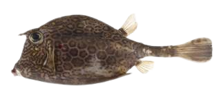
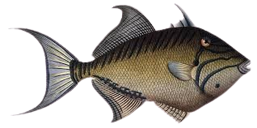
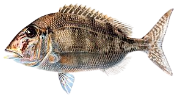
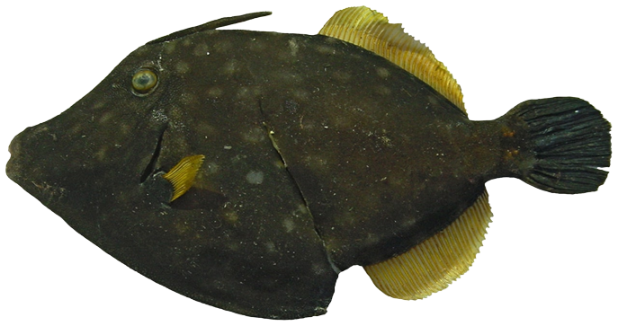
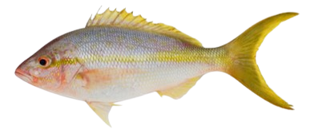
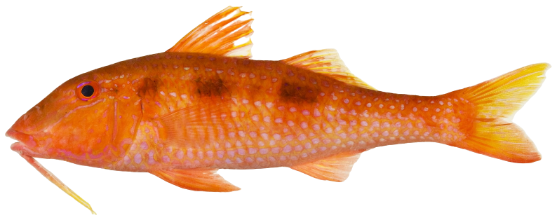
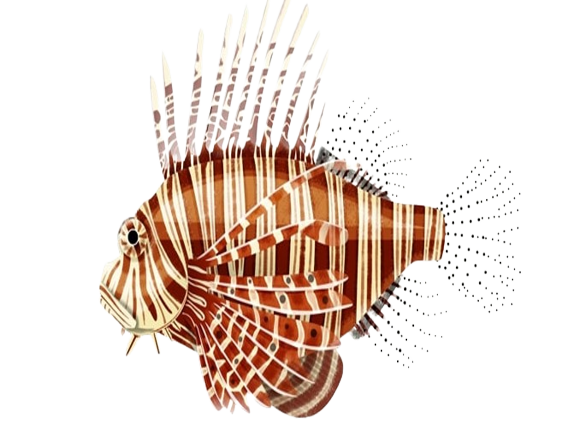
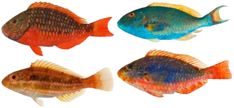

```{r , include=FALSE}
#If new species were to be added, here is the template section that must be added to the script to have access to this new species identification guide in the GitHub pages (text to change will be surrounded by "!" ) : 

#<h2>*!Scientific name!* / !Vernacular name!</h2>

#{width=250px} {height=26px width=20px} [Femelle](Echelle_!Scientific name!_F.html){target="_blank"} / [Mâle](Echelle_!Scientific name!_M.html){target="_blank"} {height=26px width=20px}
```

<html>
<head>
<style media="all"> 
  body {
        /* to centre page on screen*/
        margin-left: auto;
        margin-right: auto;
        font-family: sans-serif;
        font-size: 20pt;
    }
    h1{
    color:white;
    font-size:30px;
    background-color:#4775D1;
    font-weight:700;
    text-align: center;
    }
    h2{
    font-size:25px;
    background-color:#E6E6FF;
    font-weight:600;
    }
    h3{
    color:red;
    font-size:20px;
    font-weight:1000;
    font-weight: bold;
    }
    hr{
    color:#4775D1;
    height:8px;
    background-color:#4775D1;
    }
    h4{
    font-size:14px;
    color:black;
    }
    p{
    font-size:
    17px;
    }
    </style>

<title>Page Title</title>
</head>
<body>
<h1>INDEX ÉCHELLE DE MATURITÉ</h1>
<center>
<h4>*Dernière mise à jour : 16/08/2022*</h4>
</center>

:::::::::::::: {.columns}
::: {.column width="10%"}

\

:::
::: {.column width="80%"}

<center>
<h2>*Acanthostracion polygonius* / Coffre nid d'abeille</h2>
{width=250px} {height=26px width=20px} [Femelle](Echelle_Acanthostracion polygonius_F.pdf){target="_blank"} / [Mâle](Echelle_Acanthostracion polygonius_M.pdf){target="_blank"} {height=26px width=20px}

\
<h2>*Acanthurus bahianus* / Chirurgien océanique</h2>
{width=250px} {height=26px width=20px} [Femelle](Echelle_Acanthurus bahianus_F.pdf){target="_blank"} / [Mâle](Echelle_Acanthurus bahianus_M.pdf){target="_blank"} {height=26px width=20px}

\
<h2>*Aluterus scriptus* / Bourse écriture</h2>
{width=250px} {height=26px width=20px} [Femelle](Echelle_Aluterus scriptus_F.pdf){target="_blank"} / [Mâle](Echelle_Aluterus scriptus_M.pdf){target="_blank"} {height=26px width=20px}

\
<h2>*Balistes vetula* / Baliste royal</h2>
{width=250px} {height=26px width=20px} [Femelle](Echelle_Balistes vetula_F.pdf){target="_blank"} / [Mâle](Echelle_Balistes vetula_M.pdf){target="_blank"} {height=26px width=20px}

\
<h2>*Calamus bajonado* / Daubenet trembleur</h2>
{width=250px} {height=26px width=20px} [Femelle](Echelle_Calamus bajonado_F.pdf){target="_blank"} / [Mâle](Echelle_Calamus bajonado_M.pdf){target="_blank"} {height=26px width=20px}

\
<h2>*Cantherhines macrocerus* / Bourse cabri</h2>
{width=250px} {height=26px width=20px} [Femelle](Echelle_Cantherhines macrocerus_F.pdf){target="_blank"} / [Mâle](Echelle_Cantherhines macrocerus_M.pdf){target="_blank"} {height=26px width=20px}

\
<h2>*Canthidermis sufflamen* / Baliste océanique</h2>
{width=250px} {height=26px width=20px} [Femelle](Echelle_Canthidermis sufflamen_F.pdf){target="_blank"} / [Mâle](Echelle_Canthidermis sufflamen_M.pdf){target="_blank"} {height=26px width=20px}

\
<h2>*Caranx sp.* / Carangues</h2>
{width=250px} {height=26px width=20px} [Femelle](Echelle_Caranx sp._F.pdf){target="_blank"} / [Mâle](Echelle_Caranx sp._M.pdf){target="_blank"} {height=26px width=20px}

\
<h2>*Epinephelinae sp.* / Mérous</h2>
{width=250px} {height=26px width=20px} [Femelle](Echelle_Epinephelinae sp._F.pdf){target="_blank"} / [Mâle](Echelle_Epinephelinae sp._M.pdf){target="_blank"} {height=26px width=20px}

\
<h2>*Etelis oculatus* / Vivaneau royale</h2>
{width=250px} {height=26px width=20px} [Femelle](Echelle_Etelis oculatus_F.pdf){target="_blank"} / [Mâle](Echelle_Etelis oculatus_M.pdf){target="_blank"} {height=26px width=20px}

\
<h2>*Haemulon sp.* / Gorettes</h2>
{width=250px} {height=26px width=20px} [Femelle](Echelle_Haemulon sp._F.pdf){target="_blank"} / [Mâle](Echelle_Haemulon sp._M.pdf){target="_blank"} {height=26px width=20px}

\
<h2>*Lutjanus sp.* / Vivaneaux</h2>
{width=250px} {height=26px width=20px} [Femelle](Echelle_Lutjanus sp._F.pdf){target="_blank"} / [Mâle](Echelle_Lutjanus sp._M.pdf){target="_blank"} {height=26px width=20px}

\
<h2>*Mulloidichthys martinicus* / Barbarin blanc</h2>
{width=250px} {height=26px width=20px} [Femelle](Echelle_Mulloidichthys martinicus_F.pdf){target="_blank"} / [Mâle](Echelle_Mulloidichthys martinicus_M.pdf){target="_blank"} {height=26px width=20px}

\
<h2>*Ocyurus chrysurus* / Sarde queue jaune</h2>
{width=250px} {height=26px width=20px} [Femelle](Echelle_Ocyurus chrysurus_F.pdf){target="_blank"} / [Mâle](Echelle_Ocyurus chrysurus_M.pdf){target="_blank"} {height=26px width=20px}

\
<h2>*Priacanthus arenatus* / Soleil franc</h2>
{width=250px} {height=26px width=20px} [Femelle](Echelle_Priacanthus arenatus_F.pdf){target="_blank"} / [Mâle](Echelle_Priacanthus arenatus_M.pdf){target="_blank"} {height=26px width=20px}

\
<h2>*Pseudupeneus maculatus* / Barbarin rouge</h2>
{width=250px} {height=26px width=20px} [Femelle](Echelle_Pseudupeneus maculatus_F.pdf){target="_blank"} / [Mâle](Echelle_Pseudupeneus maculatus_M.pdf){target="_blank"} {height=26px width=20px}

\
<h2>*Pterois volitans* / Rascasse volante</h2>
{width=250px} {height=26px width=20px} [Femelle](Echelle_Pterois volitans_F.pdf){target="_blank"} / [Mâle](Echelle_Pterois volitans_M.pdf){target="_blank"} {height=26px width=20px}

\
<h2>*Sparisoma sp.* / Perroquet</h2>
{width=250px} {height=26px width=20px} [Femelle](Echelle_Sparisoma sp._F.pdf){target="_blank"} / [Mâle](Echelle_Sparisoma sp._M.pdf){target="_blank"} {height=26px width=20px}

</center>

:::
::: {.column width="10%"}

\

:::
::::::::::::::


\
<center>
{height=26px width=20px} <a href="#" onclick="history.go(-1)" style="color:black;font-size:20px;">Retour</a>
</center>
\
\
Anna LE MELEDER  
IFREMER / RBE-HMMN-LRHPB

</body>
</html>
