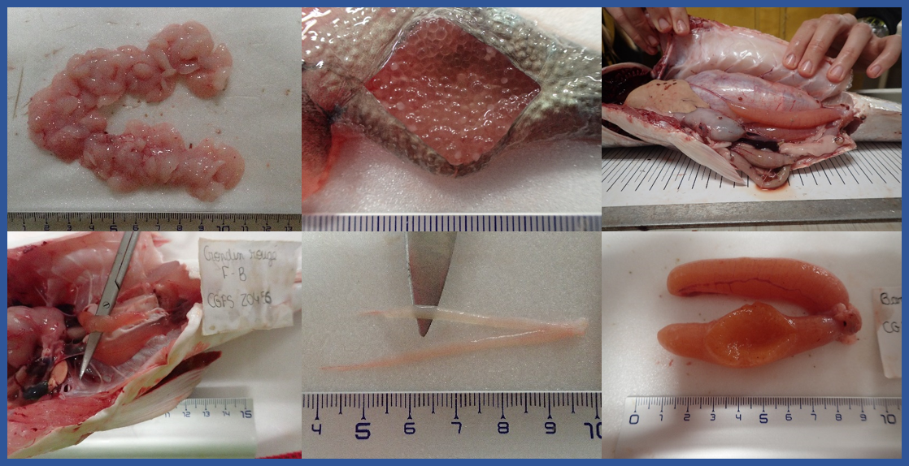

<html>
<head>

<title>Page Title</title>

</head>

<body>

<h1>MATURITY SCALE TOOLS</h1>

<h4>*Last update : 11/08/2022*</h4>

\

:::::::::::::: {.columns}
::: {.column width="40%"}

[ENGLISH](eng.html)

:::
::: {.column width="20%"}

\

:::
::: {.column width="40%"}

[FRANÇAIS](fr.html)

:::
::::::::::::::

\

\

\

{width=800px}

\

\

\

\

\

\

Anna LE MELEDER  
IFREMER / RBE-HMMN-LRHPB

</body>
</html>